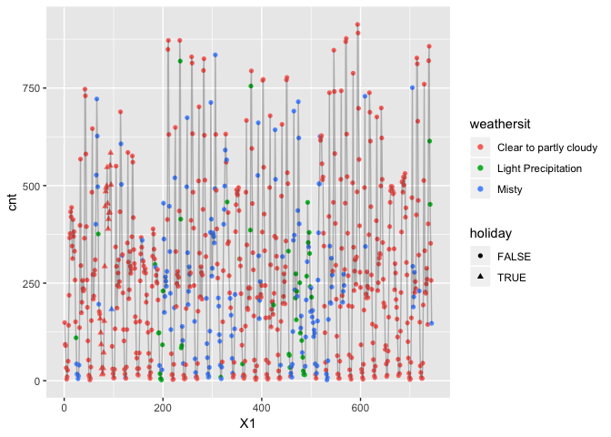
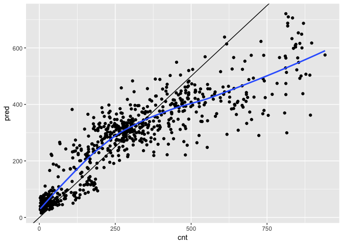

01\_practice\_ranger.Rmd
================

Overview
========

In this document, I will try to understand how xgboost works for classification. To better understand how to use this tool, I will use the bikesJuly dataset, and try to build a classifier from that dataset.

Load Packages
=============

``` r
library(tidyverse)
```

    ## ── Attaching packages ──────────────────────────────────────────────────────────────────────────── tidyverse 1.2.1 ──

    ## ✔ ggplot2 3.1.0     ✔ purrr   0.2.5
    ## ✔ tibble  2.0.1     ✔ dplyr   0.7.8
    ## ✔ tidyr   0.8.2     ✔ stringr 1.3.1
    ## ✔ readr   1.3.1     ✔ forcats 0.3.0

    ## ── Conflicts ─────────────────────────────────────────────────────────────────────────────── tidyverse_conflicts() ──
    ## ✖ dplyr::filter() masks stats::filter()
    ## ✖ dplyr::lag()    masks stats::lag()

``` r
library(ranger)
```

Load Data
=========

``` r
bikes_july <- read_csv("../Data/BikesJuly.csv")
```

    ## Warning: Missing column names filled in: 'X1' [1]

    ## Parsed with column specification:
    ## cols(
    ##   X1 = col_double(),
    ##   hr = col_double(),
    ##   holiday = col_logical(),
    ##   workingday = col_logical(),
    ##   weathersit = col_character(),
    ##   temp = col_double(),
    ##   atemp = col_double(),
    ##   hum = col_double(),
    ##   windspeed = col_double(),
    ##   cnt = col_double(),
    ##   instant = col_double(),
    ##   mnth = col_double(),
    ##   yr = col_double()
    ## )

``` r
bikes_aug <- read_csv("../Data/BikesAugust.csv")
```

    ## Warning: Missing column names filled in: 'X1' [1]

    ## Parsed with column specification:
    ## cols(
    ##   X1 = col_double(),
    ##   hr = col_double(),
    ##   holiday = col_logical(),
    ##   workingday = col_logical(),
    ##   weathersit = col_character(),
    ##   temp = col_double(),
    ##   atemp = col_double(),
    ##   hum = col_double(),
    ##   windspeed = col_double(),
    ##   cnt = col_double(),
    ##   instant = col_double(),
    ##   mnth = col_double(),
    ##   yr = col_double()
    ## )

Explore the Data
================

How do rentals change by date?

### Visualization

Create a scatter plot of the date with y equal to bike rentals, and x equal to date. Color according to weather, and shape according to type of day.

``` r
bikes_july %>% 
  ggplot(aes(
    x = X1,
    y = cnt
  )) +
  geom_point(aes(
    color = weathersit,
    shape = holiday)) +
  geom_line(alpha = 0.25)
```



### Structure

``` r
str(bikes_july)
```

    ## Classes 'spec_tbl_df', 'tbl_df', 'tbl' and 'data.frame': 744 obs. of  13 variables:
    ##  $ X1        : num  1 2 3 4 5 6 7 8 9 10 ...
    ##  $ hr        : num  0 1 2 3 4 5 6 7 8 9 ...
    ##  $ holiday   : logi  FALSE FALSE FALSE FALSE FALSE FALSE ...
    ##  $ workingday: logi  FALSE FALSE FALSE FALSE FALSE FALSE ...
    ##  $ weathersit: chr  "Clear to partly cloudy" "Clear to partly cloudy" "Clear to partly cloudy" "Clear to partly cloudy" ...
    ##  $ temp      : num  0.76 0.74 0.72 0.72 0.7 0.68 0.7 0.74 0.78 0.82 ...
    ##  $ atemp     : num  0.727 0.697 0.697 0.712 0.667 ...
    ##  $ hum       : num  0.66 0.7 0.74 0.84 0.79 0.79 0.79 0.7 0.62 0.56 ...
    ##  $ windspeed : num  0 0.1343 0.0896 0.1343 0.194 ...
    ##  $ cnt       : num  149 93 90 33 4 10 27 50 142 219 ...
    ##  $ instant   : num  13004 13005 13006 13007 13008 ...
    ##  $ mnth      : num  7 7 7 7 7 7 7 7 7 7 ...
    ##  $ yr        : num  1 1 1 1 1 1 1 1 1 1 ...
    ##  - attr(*, "spec")=
    ##   .. cols(
    ##   ..   X1 = col_double(),
    ##   ..   hr = col_double(),
    ##   ..   holiday = col_logical(),
    ##   ..   workingday = col_logical(),
    ##   ..   weathersit = col_character(),
    ##   ..   temp = col_double(),
    ##   ..   atemp = col_double(),
    ##   ..   hum = col_double(),
    ##   ..   windspeed = col_double(),
    ##   ..   cnt = col_double(),
    ##   ..   instant = col_double(),
    ##   ..   mnth = col_double(),
    ##   ..   yr = col_double()
    ##   .. )

Build a Random Forest with Ranger
=================================

The goal of this classifier is to predict the number of bikes rented in an hour, given that we know weather, type of day, and time of day.

Set the seed for reproducible (but random) results.

``` r
set.seed(42)
```

The ranger() function builds a random forest model, and it takes formula, data, num.trees, respect.unordered.factors, and seed as inputs. We need to make the formula ourselves.

Define the output column (dependent variable of model).

``` r
# If this dependent (outcome) variable is a numeric value, ranger automatically runs a regression. Otherwise, it runs classification.
dependent <- "cnt"
```

Specify the variables of the random forest (independent variables).

``` r
independent <- c("hr", "holiday", "workingday", "weathersit", "temp", "atemp", "hum", "windspeed")
```

Create the formula.

``` r
(fmla <- paste(dependent, "~", paste(independent, collapse = " + ")))
```

    ## [1] "cnt ~ hr + holiday + workingday + weathersit + temp + atemp + hum + windspeed"

### Fit and print the random forest model.

``` r
(bike_model_rf <- ranger(formula = fmla,
                        data = bikes_july,
                        num.trees = 500, # This should be greater than 200, 500 is default
                        respect.unordered.factors = "order", 
                        seed = 42
                        ))
```

    ## Ranger result
    ## 
    ## Call:
    ##  ranger(formula = fmla, data = bikes_july, num.trees = 500, respect.unordered.factors = "order",      seed = 42) 
    ## 
    ## Type:                             Regression 
    ## Number of trees:                  500 
    ## Sample size:                      744 
    ## Number of independent variables:  8 
    ## Mtry:                             2 
    ## Target node size:                 5 
    ## Variable importance mode:         none 
    ## Splitrule:                        variance 
    ## OOB prediction error (MSE):       10557.43 
    ## R squared (OOB):                  0.7698094

``` r
# Note: respect.unordered.factorsTells ranger how to treat categorical variables. This safely and meaningfully encodes categorical variables as numbers. It also runs faster than converting categoricals to indicator variables

# What is printed? At the bottom, we get the Out of Bag Mean Squared Error as well as the Out of Bag R Squared value. These are estimates on how it will run on future data.
```

### Make predictions

With the new model, add predictions to the bikes\_aug dataset.

``` r
# The predict() function takes a model and a new dataset. 
(bikes_aug$pred <- predict(bike_model_rf, bikes_aug)$predictions)
```

    ##   [1]  57.55708  27.92342  34.80270  31.71645  40.48542  50.49968 135.58815
    ##   [8] 255.57238 410.73020 374.87113 335.85879 293.22099 304.57557 298.80600
    ##  [15] 304.78716 313.24637 407.85722 598.33672 503.60101 406.65389 421.52962
    ##  [22] 299.84750 241.90958 206.22558  55.57914  33.20629  20.86715  15.79813
    ##  [29]  15.79554  38.77859 118.71304 375.57104 573.71404 385.60576 321.31894
    ##  [36] 317.80975 285.74621 270.38049 302.38655 458.44995 454.39505 599.96421
    ##  [43] 435.61636 435.74235 322.42632 324.63711 293.40200 242.30109  59.42108
    ##  [50]  33.12150  56.22123  53.91609  46.19964  42.55969 140.16224 436.52703
    ##  [57] 465.72227 376.36854 261.48708 247.85076 267.47741 276.84005 271.58310
    ##  [64] 277.21761 441.38690 483.10118 390.41397 400.65346 353.69396 332.36469
    ##  [71] 286.01209 229.14457  89.06149  68.72948  76.58637  58.98250  55.37691
    ##  [78]  63.77134  96.24939 265.98932 254.73509 268.77558 324.86700 405.91796
    ##  [85] 406.30147 392.30989 404.01433 419.67042 395.50541 435.71148 478.90901
    ##  [92] 488.45390 444.88879 327.52546 302.61242 291.68818 116.92224  93.00369
    ##  [99]  99.97242  81.37390  78.73436  80.32516 111.03961 260.93167 382.18124
    ## [106] 369.98678 416.63426 403.56549 420.27845 417.56540 405.03755 404.51022
    ## [113] 471.18675 489.77627 397.83191 308.51751 307.27011 276.37886 214.31386
    ## [120] 242.41897  91.35931  73.20055  74.16611  72.12849  73.34244  41.13089
    ## [127] 144.20441 376.91775 461.55020 354.43775 321.79955 320.18414 298.00118
    ## [134] 275.61809 317.00911 331.94850 440.68556 615.88178 608.45644 385.55787
    ## [141] 393.84096 345.72875 263.56818 256.41441  59.41254  47.74726  45.65834
    ## [148]  37.44927  34.74037  48.95457 113.27362 472.84889 493.01920 361.81197
    ## [155] 320.82106 357.49628 308.36838 272.98028 322.19789 329.16697 415.12871
    ## [162] 437.96204 513.20144 444.34858 392.47217 324.96153 284.44901 241.82398
    ## [169]  58.33318  64.24152  39.06318  37.44927  37.10279  71.98333 118.74053
    ## [176] 393.56216 490.72575 335.07078 279.78788 297.71250 306.54209 308.26476
    ## [183] 280.89542 282.14332 416.19234 492.25315 500.55805 424.83128 407.83391
    ## [190] 355.82784 284.44901 200.94951  79.82293  41.97386  45.29668  29.85477
    ## [197]  54.80528  30.67856 144.46810 393.56216 573.71404 348.85971 272.47932
    ## [204] 273.98350 298.20039 308.23182 289.18930 298.30863 447.03675 570.89240
    ## [211] 529.04656 464.09804 378.30471 278.71685 236.56574 216.58564  68.44851
    ## [218]  48.83620  35.46663  59.56705  72.95005  81.18773 105.81028 200.54319
    ## [225] 235.37816 216.78354 267.13566 328.15701 396.63070 417.75323 483.16244
    ## [232] 395.59164 447.44379 622.86717 565.90880 519.78508 412.10050 334.78665
    ## [239] 296.18975 245.25896  98.35526  75.69956  73.87744  67.12545  45.71002
    ## [246]  46.50592  66.09740 143.98986 232.45334 274.89873 391.46428 392.03815
    ## [253] 405.76972 429.28361 436.11155 454.98931 454.74392 469.09182 398.44679
    ## [260] 251.72896 365.12374 226.66437 193.72506 217.41720  87.28892  79.28089
    ## [267]  66.55433  47.46908  35.30811  45.57973  79.88340 223.67528 273.80594
    ## [274] 332.36309 333.68411 392.62827 397.18716 398.43543 444.04863 437.07212
    ## [281] 443.18527 523.89188 465.16983 438.66282 357.97591 311.26180 230.46428
    ## [288] 210.75379  55.80909  34.25465  27.88611  26.91607  25.06637  37.82133
    ## [295] 115.95514 366.57833 417.89169 309.29857 333.68580 325.03666 354.58576
    ## [302] 365.90639 346.68833 274.78992 421.18166 677.47704 720.95685 455.38253
    ## [309] 398.58920 303.79855 311.93746 222.29794  85.35133  69.19374  72.14735
    ## [316]  69.17087  68.87718  65.83344 108.92690 353.37724 294.01621 362.83638
    ## [323] 371.73884 330.42203 343.10367 296.39508 275.65471 295.12963 433.54037
    ## [330] 474.04842 548.62049 425.63918 371.13349 341.35610 255.09772 206.92421
    ## [337]  62.68188  44.78381  31.95644  26.62723  31.52690  43.32253 127.09357
    ## [344] 347.91655 435.37610 268.31493 252.86540 274.68941 349.23085 304.44997
    ## [351] 326.27751 384.94110 502.42212 564.57650 522.29659 364.31883 345.54717
    ## [358] 286.96261 243.61907 237.45478  45.27586  35.07904  37.12401  51.12946
    ## [365]  39.98978  59.78764 132.63497 311.50509 441.88425 319.93742 321.06022
    ## [372] 315.96463 344.88706 333.06531 332.41924 321.59009 460.70130 617.13697
    ## [379] 632.80502 552.93672 450.52857 392.30754 289.36018 237.41801  77.45498
    ## [386]  45.66232  47.59442  40.63522  48.79762  47.33611 126.74829 294.45992
    ## [393] 396.42821 320.07815 355.73978 384.10627 375.72808 373.13601 395.96658
    ## [400] 397.33711 461.69400 565.76233 524.18269 433.67414 323.46062 276.25177
    ## [407] 176.69570 170.16365  88.46294  97.33048  93.46895  49.75608  38.45703
    ## [414]  55.24252  82.24232 179.44792 174.72794 220.78284 322.14784 339.45568
    ## [421] 410.89162 396.86186 411.61855 423.81134 456.45658 525.17070 470.61737
    ## [428] 423.05474 371.53822 266.53557 238.47158 228.89987 101.90555  69.65449
    ## [435]  61.92357  53.48208  50.36718  61.62984  58.78322 219.44987 246.12353
    ## [442] 342.21006 333.54597 270.09453 310.41411 241.56914 312.72635 321.61788
    ## [449] 352.13414 236.32588 231.51244 302.37955 280.30132 192.10132 185.45845
    ## [456] 188.77558  80.51894  63.96634  60.85243  39.62007  55.16779  57.01951
    ## [463] 117.63119 278.59902 308.64717 318.04629 314.62293 321.65935 324.34422
    ## [470] 334.47223 334.16193 340.09436 375.49264 362.07102 299.47557 281.67734
    ## [477] 219.08002 191.15346 172.74891 171.18931  71.94683  77.49725  62.31073
    ## [484]  28.27707  27.76507  41.17134 115.64114 264.44117 290.09141 303.39869
    ## [491] 314.25712 346.56717 313.42250 319.26774 322.28678 318.59076 414.55037
    ## [498] 506.75150 444.42930 268.48674 299.18495 271.99378 195.19961 155.35191
    ## [505]  50.96670  32.62832  29.38895  27.50947  40.23395  40.30605 104.64141
    ## [512] 247.91597 378.67666 341.01236 313.52595 315.90244 293.04805 324.86278
    ## [519] 314.53946 382.10814 387.39932 474.38992 332.82065 357.89305 308.84979
    ## [526] 271.99378 237.69167 159.79643  42.87227  29.63115  25.59808  26.93042
    ## [533]  23.99656  32.88924  94.23725 221.25461 425.78054 370.24606 352.30760
    ## [540] 318.87912 316.24655 294.45923 331.38464 346.24990 504.00097 709.63463
    ## [547] 574.88445 383.90449 327.98153 300.48385 246.80135 225.94656  50.33722
    ## [554]  44.62371  22.73737  29.62863  37.85380  35.92734  85.16343 259.21282
    ## [561] 424.03252 324.32983 312.06161 307.81569 311.85657 328.36043 331.05096
    ## [568] 332.54888 445.89121 434.84122 366.93333 358.49223 339.23766 277.85207
    ## [575] 256.62555 232.42478 115.29464  86.85833  85.80681  45.01338  46.37626
    ## [582]  55.04604  73.01276 172.70083 287.88960 311.91873 340.53748 347.49877
    ## [589] 367.30066 373.03400 314.48049 375.83659 350.95424 418.80522 429.42912
    ## [596] 256.86767 217.84019 243.96783 235.05385 176.53607  97.71513  80.26676
    ## [603]  79.72528  67.23629  63.26673  57.38101  85.98925 166.29851 254.38637
    ## [610] 273.36659 429.69323 441.03286 408.88750 426.91678 219.32793 258.97866
    ## [617] 259.95729 236.14723 201.89673 221.79415 205.03485 197.29415 177.52517
    ## [624] 167.36211  40.76672  39.10858  41.78075  31.62789  23.99656  33.59714
    ## [631]  96.54645 311.44422 346.48500 305.79899 388.39959 326.02373 289.09890
    ## [638] 303.07570 303.29182 308.42901 399.79803 612.47405 705.92962 418.43650
    ## [645] 410.41366 336.57353 249.72646 233.80598  96.43722  57.55169  75.24511
    ## [652]  26.49638  26.31085  45.84735 114.16267 369.97881 373.03537 341.03661
    ## [659] 318.09798 288.83419 285.11561 273.86025 290.92890 277.19163 461.38950
    ## [666] 648.45650 687.33120 515.90621 372.06268 327.66521 282.47079 232.02800
    ## [673]  45.27586  40.91989  40.53908  32.88555  46.50792  53.68329 123.39342
    ## [680] 342.22999 369.67669 367.70326 331.35160 309.86862 328.35991 301.81175
    ## [687] 335.49154 373.14283 482.30842 686.96652 564.00619 400.07216 329.32327
    ## [694] 304.85409 273.15359 225.08351  45.47112  37.09991  32.12962  31.19848
    ## [701]  31.28674  39.49069 133.50455 340.13316 361.26633 313.89851 301.49988
    ## [708] 325.03666 344.07631 324.86278 368.65457 297.72089 449.32587 603.22663
    ## [715] 653.08301 638.29657 415.81700 303.54160 215.10882 222.73466  65.99565
    ## [722]  47.96161  28.47979  29.13230  29.81044  55.03099 127.48757 221.87058
    ## [729] 487.88338 319.48708 318.36675 256.41336 278.91131 281.62660 300.25687
    ## [736] 290.13598 443.61831 613.93513 568.54211 549.17647 455.82205 324.36338
    ## [743] 290.97332 260.62903

### Summarize the model's fit to bikes\_aug

``` r
bikes_aug %>% 
  mutate(residual = cnt - pred)  %>%        # calculate the residual
  summarize(rmse  = sqrt(mean(residual^2))) # calculate rmse
```

    ## # A tibble: 1 x 1
    ##    rmse
    ##   <dbl>
    ## 1  116.

### Visualize how well the model fits

``` r
bikes_aug %>% 
  ggplot(aes(x = cnt,
             y = pred)) +
  geom_point() +
  geom_abline(slope = 1, intercept = 0) +
  geom_smooth(se = FALSE)
```

    ## `geom_smooth()` using method = 'loess' and formula 'y ~ x'

 There seems to be a systematic error in our model as we try to predict larger values of rentals, but predictions below 500 seem more or less reasonable. Overall, it is not a very good model.
