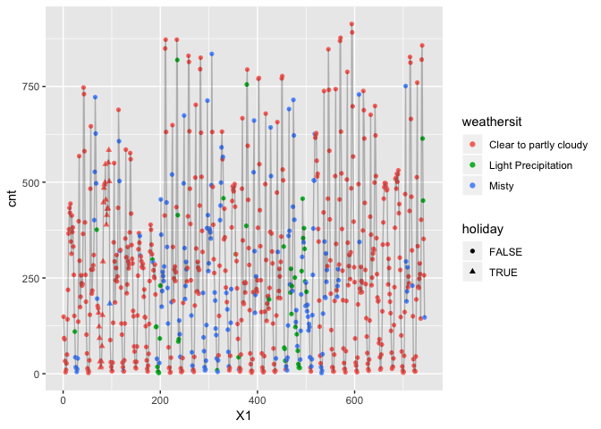
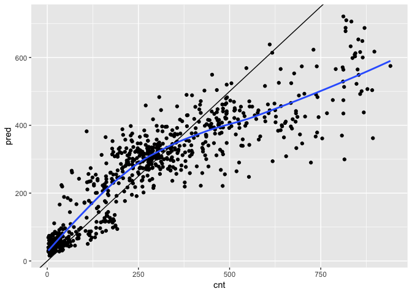

01\_practice\_ranger.Rmd
================

Overview
========

In this document, I will try to understand how xgboost works for classification. To better understand how to use this tool, I will use the bikesJuly dataset (found on Kaggle, referenced in the ReadMe), and try to build a model that predicts how many bikes will be rented in an hour, given that we know weather, time of day, and a few other things.

Load Packages
=============

``` r
library(tidyverse)
```

    ## ── Attaching packages ──────────────────────────────────────────────────────────────────────────── tidyverse 1.2.1 ──

    ## ✔ ggplot2 3.1.0     ✔ purrr   0.2.5
    ## ✔ tibble  2.0.1     ✔ dplyr   0.7.8
    ## ✔ tidyr   0.8.2     ✔ stringr 1.3.1
    ## ✔ readr   1.3.1     ✔ forcats 0.3.0

    ## ── Conflicts ─────────────────────────────────────────────────────────────────────────────── tidyverse_conflicts() ──
    ## ✖ dplyr::filter() masks stats::filter()
    ## ✖ dplyr::lag()    masks stats::lag()

``` r
library(ranger)
```

Load Data
=========

``` r
bikes_july <- read_csv("../Data/BikesJuly.csv")
```

    ## Warning: Missing column names filled in: 'X1' [1]

    ## Parsed with column specification:
    ## cols(
    ##   X1 = col_double(),
    ##   hr = col_double(),
    ##   holiday = col_logical(),
    ##   workingday = col_logical(),
    ##   weathersit = col_character(),
    ##   temp = col_double(),
    ##   atemp = col_double(),
    ##   hum = col_double(),
    ##   windspeed = col_double(),
    ##   cnt = col_double(),
    ##   instant = col_double(),
    ##   mnth = col_double(),
    ##   yr = col_double()
    ## )

``` r
bikes_aug <- read_csv("../Data/BikesAugust.csv")
```

    ## Warning: Missing column names filled in: 'X1' [1]

    ## Parsed with column specification:
    ## cols(
    ##   X1 = col_double(),
    ##   hr = col_double(),
    ##   holiday = col_logical(),
    ##   workingday = col_logical(),
    ##   weathersit = col_character(),
    ##   temp = col_double(),
    ##   atemp = col_double(),
    ##   hum = col_double(),
    ##   windspeed = col_double(),
    ##   cnt = col_double(),
    ##   instant = col_double(),
    ##   mnth = col_double(),
    ##   yr = col_double()
    ## )

Explore the Data
================

How do rentals change by date?

### Visualization

Create a scatter plot of the date with y equal to bike rentals, and x equal to date. Color according to weather, and shape according to type of day.

``` r
bikes_july %>% 
  ggplot(aes(
    x = X1,
    y = cnt
  )) +
  geom_point(aes(
    color = weathersit,
    shape = holiday)) +
  geom_line(alpha = 0.25)
```



### Structure

``` r
str(bikes_july)
```

    ## Classes 'spec_tbl_df', 'tbl_df', 'tbl' and 'data.frame': 744 obs. of  13 variables:
    ##  $ X1        : num  1 2 3 4 5 6 7 8 9 10 ...
    ##  $ hr        : num  0 1 2 3 4 5 6 7 8 9 ...
    ##  $ holiday   : logi  FALSE FALSE FALSE FALSE FALSE FALSE ...
    ##  $ workingday: logi  FALSE FALSE FALSE FALSE FALSE FALSE ...
    ##  $ weathersit: chr  "Clear to partly cloudy" "Clear to partly cloudy" "Clear to partly cloudy" "Clear to partly cloudy" ...
    ##  $ temp      : num  0.76 0.74 0.72 0.72 0.7 0.68 0.7 0.74 0.78 0.82 ...
    ##  $ atemp     : num  0.727 0.697 0.697 0.712 0.667 ...
    ##  $ hum       : num  0.66 0.7 0.74 0.84 0.79 0.79 0.79 0.7 0.62 0.56 ...
    ##  $ windspeed : num  0 0.1343 0.0896 0.1343 0.194 ...
    ##  $ cnt       : num  149 93 90 33 4 10 27 50 142 219 ...
    ##  $ instant   : num  13004 13005 13006 13007 13008 ...
    ##  $ mnth      : num  7 7 7 7 7 7 7 7 7 7 ...
    ##  $ yr        : num  1 1 1 1 1 1 1 1 1 1 ...
    ##  - attr(*, "spec")=
    ##   .. cols(
    ##   ..   X1 = col_double(),
    ##   ..   hr = col_double(),
    ##   ..   holiday = col_logical(),
    ##   ..   workingday = col_logical(),
    ##   ..   weathersit = col_character(),
    ##   ..   temp = col_double(),
    ##   ..   atemp = col_double(),
    ##   ..   hum = col_double(),
    ##   ..   windspeed = col_double(),
    ##   ..   cnt = col_double(),
    ##   ..   instant = col_double(),
    ##   ..   mnth = col_double(),
    ##   ..   yr = col_double()
    ##   .. )

Build a Random Forest with Ranger
=================================

The goal of this classifier is to predict the number of bikes rented in an hour, given that we know weather, type of day, and time of day.

Set the seed for reproducible (but random) results.

``` r
set.seed(42)
```

The ranger() function builds a random forest model, and it takes formula, data, num.trees, respect.unordered.factors, and seed as inputs. We need to make the formula ourselves.

Define the output column (dependent variable of model).

``` r
# If this dependent (outcome) variable is a numeric value, ranger automatically runs a regression. Otherwise, it runs classification.
dependent <- "cnt"
```

Specify the variables of the random forest (independent variables).

``` r
independent <- c("hr", "holiday", "workingday", "weathersit", "temp", "atemp", "hum", "windspeed")
```

Create the formula.

``` r
(fmla <- paste(dependent, "~", paste(independent, collapse = " + ")))
```

    ## [1] "cnt ~ hr + holiday + workingday + weathersit + temp + atemp + hum + windspeed"

### Fit and Print the Random Forest Model.

``` r
(bike_model_rf <- ranger(formula = fmla,
                        data = bikes_july,
                        num.trees = 500, # This should be greater than 200, 500 is default
                        respect.unordered.factors = "order", 
                        seed = 42
                        ))
```

    ## Ranger result
    ## 
    ## Call:
    ##  ranger(formula = fmla, data = bikes_july, num.trees = 500, respect.unordered.factors = "order",      seed = 42) 
    ## 
    ## Type:                             Regression 
    ## Number of trees:                  500 
    ## Sample size:                      744 
    ## Number of independent variables:  8 
    ## Mtry:                             2 
    ## Target node size:                 5 
    ## Variable importance mode:         none 
    ## Splitrule:                        variance 
    ## OOB prediction error (MSE):       10557.43 
    ## R squared (OOB):                  0.7698094

Note: respect.unordered.factorsTells ranger how to treat categorical variables. This safely and meaningfully encodes categorical variables as numbers. It also runs faster than converting categoricals to indicator variables

What is printed? At the bottom, we get the Out of Bag Mean Squared Error as well as the Out of Bag R Squared value. These are estimates on how it will run on future data.

### Make Predictions

With the new model, add predictions to the bikes\_aug dataset.

``` r
# The predict() function takes a model and a new dataset. 
bikes_aug$pred <- predict(bike_model_rf, bikes_aug)$predictions

(bikes_aug %>% 
  select(cnt, pred))
```

    ## # A tibble: 744 x 2
    ##      cnt  pred
    ##    <dbl> <dbl>
    ##  1    47  57.6
    ##  2    33  27.9
    ##  3    13  34.8
    ##  4     7  31.7
    ##  5     4  40.5
    ##  6    49  50.5
    ##  7   185 136. 
    ##  8   487 256. 
    ##  9   681 411. 
    ## 10   350 375. 
    ## # … with 734 more rows

### Summarize the Model's Fit to bikes\_aug

``` r
(bikes_aug %>% 
  mutate(residual = cnt - pred)  %>%        # calculate the residual
  summarize(rmse  = sqrt(mean(residual^2)))) # calculate rmse
```

    ## # A tibble: 1 x 1
    ##    rmse
    ##   <dbl>
    ## 1  116.

### Visualize How Well the Model Fits

``` r
bikes_aug %>% 
  ggplot(aes(x = cnt,
             y = pred)) +
  geom_point() +
  geom_abline(slope = 1, intercept = 0) +
  geom_smooth(se = FALSE)
```

    ## `geom_smooth()` using method = 'loess' and formula 'y ~ x'



Analysis of Ranger Model
========================

With actual values of known bike rentals on the x-axis, and predicted values on the y axis, we can visualize how well the model fits the test data. If it were an absolute perfect model, predictions would equal known values, and the points would perfectly fit on they y = x line (the black line I have printed for reference).

To help visualize the deviance this model has from the test data, I have plotted a geom\_smooth() line (the blue line), which follows the general path of the data. We see that the model seems to over-predict when bike rentals are under 300, and under-predict when bike rentals are above 300.

There seems to be a systematic error in our model as we try to predict larger values of rentals, but predictions below 500 seem more or less reasonable. Overall, it is not a very good model, and it has likely overfit our data.
