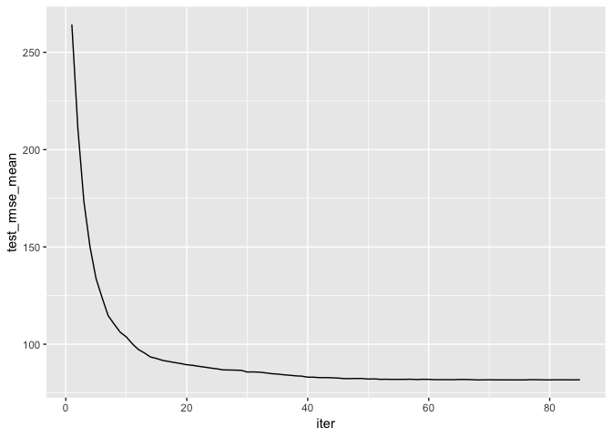
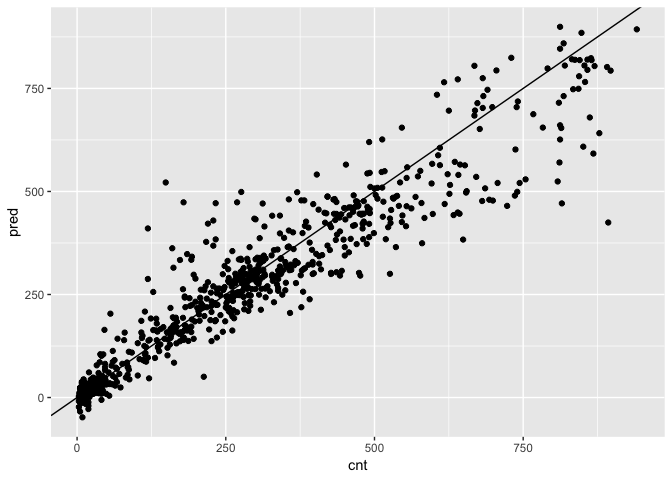

02\_practice\_xgboost
================

Overview
========

In this code, I will be exploring the xgboost package as well as the vtreat package. XGBoost can help us create a model for classification as well as regression. The vtreat package can help us prepare our data in a format compatible with XGBoost (one-hot encoded).

For practice, I will be createing an xgboost model that predicts how many bike rentals occur in an hour, given the time of day, weather, and other factors. I will be using the bikesJuly dataset for training and the bikesAugust dataset for testing (both datasets are found on Kaggle, and are referenced in the ReadMe). I will be closely following a datacamp tutorial to help me better understand the xgboost and vtreat package (also referenced on the ReadMe).

This model will be similar to the Ranger model I made in 01\_practice\_ranger.RMD, but it should perform better.

Load Packages
=============

``` r
library(tidyverse)
```

    ## ── Attaching packages ──────────────────────────────────────────────────────────────────────────── tidyverse 1.2.1 ──

    ## ✔ ggplot2 3.1.0     ✔ purrr   0.2.5
    ## ✔ tibble  2.0.1     ✔ dplyr   0.7.8
    ## ✔ tidyr   0.8.2     ✔ stringr 1.3.1
    ## ✔ readr   1.3.1     ✔ forcats 0.3.0

    ## ── Conflicts ─────────────────────────────────────────────────────────────────────────────── tidyverse_conflicts() ──
    ## ✖ dplyr::filter() masks stats::filter()
    ## ✖ dplyr::lag()    masks stats::lag()

``` r
library(vtreat)
library(xgboost)
```

    ## 
    ## Attaching package: 'xgboost'

    ## The following object is masked from 'package:dplyr':
    ## 
    ##     slice

Load Data
=========

``` r
bikes_july <- read_csv("../Data/BikesJuly.csv")%>% 
  mutate(hr_new = as.factor(hr)) # Later in the analysis, it will be important to keep hr as a factor as opposed to a double.
```

    ## Warning: Missing column names filled in: 'X1' [1]

    ## Parsed with column specification:
    ## cols(
    ##   X1 = col_double(),
    ##   hr = col_double(),
    ##   holiday = col_logical(),
    ##   workingday = col_logical(),
    ##   weathersit = col_character(),
    ##   temp = col_double(),
    ##   atemp = col_double(),
    ##   hum = col_double(),
    ##   windspeed = col_double(),
    ##   cnt = col_double(),
    ##   instant = col_double(),
    ##   mnth = col_double(),
    ##   yr = col_double()
    ## )

``` r
bikes_aug <- read_csv("../Data/BikesAugust.csv") %>% 
  mutate(hr_new = as.factor(hr)) # Later in the analysis, it will be important to keep hr as a factor as opposed to a double.
```

    ## Warning: Missing column names filled in: 'X1' [1]

    ## Parsed with column specification:
    ## cols(
    ##   X1 = col_double(),
    ##   hr = col_double(),
    ##   holiday = col_logical(),
    ##   workingday = col_logical(),
    ##   weathersit = col_character(),
    ##   temp = col_double(),
    ##   atemp = col_double(),
    ##   hum = col_double(),
    ##   windspeed = col_double(),
    ##   cnt = col_double(),
    ##   instant = col_double(),
    ##   mnth = col_double(),
    ##   yr = col_double()
    ## )

Intro to One-Hot Encoding
=========================

R packages usually handle categorical variables well; however, xgboost does not. To work with xgboost, we need to know how to convert categorical variables (strings) into indicator variables, or one-hot encoded vectors. We will use the vtreat package to one-hot encode categorical variables.

One-hot encoded vectors are a numerical representation for a categorical variable. The vector length represents the number of total variable values, and each index of the vector represents a True/False value for that variable. In the vector, only one number will take the value of true (1) and the rest will take the value of false (0). This is why they are called one-hot encoded--only one value is "hot" or true in the vector.

Example: Lets say we have three categorical variables, red, green, and blue. We could represent red as \[1, 0, 0\], green as \[0, 1, 0\], and blue as \[0, 0, 1\].

The vtreat package
==================

We use the vtreat package to help one-hot encode our categorical variables. There are two main functions we will use \* designTreatmentsZ() \* Records the steps necessary to one-hot encode this data and future data inputs. \* This function feeds into prepare \* prepare() \* converts data into xgboost-compatible data (all numerical, no missing values)

Using the designtreatmentsZ() Function
======================================

``` r
# Identify the output column (dependent variable/response variable)
response <- "cnt"

# Identify the input columns (independent variables/explanatory variables)
explanatory <- c("hr_new", "holiday", "workingday", "weathersit", "temp", "atemp", "hum", "windspeed")

# Create the treatment plan, using designtreatmentsZ(). This treatment plan will be fed into prepare.
treatplan <- designTreatmentsZ(dframe = bikes_july, 
                               varlist = explanatory, 
                               verbose = FALSE) # Will not print progress
```

Find and Store the clean and lev Variables
==========================================

The designTreatmentsZ() creates a list. One of the elements of the list is scoreFrame, which contains a list of new variable names, and the old variable names. In this example, we had the weathersit variable which had three levels (partly cloudy, light precipitation, and misty). Each of these weathersit levels got a new variable name (listed in varName column of the scoreframe). origName is the old variable name.

The code column lists what types of variables each variable is. Some are clean (meaning they are numeric or binary, and they have been cleaned for NaNs and NAs (? I think this is correct?)). Others are catP's meaning they are categorical variables that need to be split into levels. lev indicates levels of a categorical variable that need to be included in the one-hot encoding vector associated with their categorical variable (origName).

We are interested in these clean and lev variables for one-hot encoding (I don't know how to articulate why, other than that we don't need the weathersit variable because we have all of its levles).

``` r
# Look at the scoreframe
treatplan$scoreFrame
```

    ##                                    varName varMoves rsq sig needsSplit
    ## 1                                  holiday     TRUE   0   1      FALSE
    ## 2                               workingday     TRUE   0   1      FALSE
    ## 3                          weathersit_catP     TRUE   0   1       TRUE
    ## 4                                     temp     TRUE   0   1      FALSE
    ## 5                                    atemp     TRUE   0   1      FALSE
    ## 6                                      hum     TRUE   0   1      FALSE
    ## 7                                windspeed     TRUE   0   1      FALSE
    ## 8                           hr_new_lev_x_0     TRUE   0   1      FALSE
    ## 9                           hr_new_lev_x_1     TRUE   0   1      FALSE
    ## 10                         hr_new_lev_x_10     TRUE   0   1      FALSE
    ## 11                         hr_new_lev_x_11     TRUE   0   1      FALSE
    ## 12                         hr_new_lev_x_12     TRUE   0   1      FALSE
    ## 13                         hr_new_lev_x_13     TRUE   0   1      FALSE
    ## 14                         hr_new_lev_x_14     TRUE   0   1      FALSE
    ## 15                         hr_new_lev_x_15     TRUE   0   1      FALSE
    ## 16                         hr_new_lev_x_16     TRUE   0   1      FALSE
    ## 17                         hr_new_lev_x_17     TRUE   0   1      FALSE
    ## 18                         hr_new_lev_x_18     TRUE   0   1      FALSE
    ## 19                         hr_new_lev_x_19     TRUE   0   1      FALSE
    ## 20                          hr_new_lev_x_2     TRUE   0   1      FALSE
    ## 21                         hr_new_lev_x_20     TRUE   0   1      FALSE
    ## 22                         hr_new_lev_x_21     TRUE   0   1      FALSE
    ## 23                         hr_new_lev_x_22     TRUE   0   1      FALSE
    ## 24                         hr_new_lev_x_23     TRUE   0   1      FALSE
    ## 25                          hr_new_lev_x_3     TRUE   0   1      FALSE
    ## 26                          hr_new_lev_x_4     TRUE   0   1      FALSE
    ## 27                          hr_new_lev_x_5     TRUE   0   1      FALSE
    ## 28                          hr_new_lev_x_6     TRUE   0   1      FALSE
    ## 29                          hr_new_lev_x_7     TRUE   0   1      FALSE
    ## 30                          hr_new_lev_x_8     TRUE   0   1      FALSE
    ## 31                          hr_new_lev_x_9     TRUE   0   1      FALSE
    ## 32 weathersit_lev_x_Clear_to_partly_cloudy     TRUE   0   1      FALSE
    ## 33    weathersit_lev_x_Light_Precipitation     TRUE   0   1      FALSE
    ## 34                  weathersit_lev_x_Misty     TRUE   0   1      FALSE
    ##    extraModelDegrees   origName  code
    ## 1                  0    holiday clean
    ## 2                  0 workingday clean
    ## 3                  2 weathersit  catP
    ## 4                  0       temp clean
    ## 5                  0      atemp clean
    ## 6                  0        hum clean
    ## 7                  0  windspeed clean
    ## 8                  0     hr_new   lev
    ## 9                  0     hr_new   lev
    ## 10                 0     hr_new   lev
    ## 11                 0     hr_new   lev
    ## 12                 0     hr_new   lev
    ## 13                 0     hr_new   lev
    ## 14                 0     hr_new   lev
    ## 15                 0     hr_new   lev
    ## 16                 0     hr_new   lev
    ## 17                 0     hr_new   lev
    ## 18                 0     hr_new   lev
    ## 19                 0     hr_new   lev
    ## 20                 0     hr_new   lev
    ## 21                 0     hr_new   lev
    ## 22                 0     hr_new   lev
    ## 23                 0     hr_new   lev
    ## 24                 0     hr_new   lev
    ## 25                 0     hr_new   lev
    ## 26                 0     hr_new   lev
    ## 27                 0     hr_new   lev
    ## 28                 0     hr_new   lev
    ## 29                 0     hr_new   lev
    ## 30                 0     hr_new   lev
    ## 31                 0     hr_new   lev
    ## 32                 0 weathersit   lev
    ## 33                 0 weathersit   lev
    ## 34                 0 weathersit   lev

``` r
# Store the new variable names
(onehot_vars <- treatplan$scoreFrame %>%               
  filter(code %in% c("clean", "lev")) %>%  # get the variables you care about (clean and lev)
  select(varName))                     # get the varName column
```

    ##                                    varName
    ## 1                                  holiday
    ## 2                               workingday
    ## 3                                     temp
    ## 4                                    atemp
    ## 5                                      hum
    ## 6                                windspeed
    ## 7                           hr_new_lev_x_0
    ## 8                           hr_new_lev_x_1
    ## 9                          hr_new_lev_x_10
    ## 10                         hr_new_lev_x_11
    ## 11                         hr_new_lev_x_12
    ## 12                         hr_new_lev_x_13
    ## 13                         hr_new_lev_x_14
    ## 14                         hr_new_lev_x_15
    ## 15                         hr_new_lev_x_16
    ## 16                         hr_new_lev_x_17
    ## 17                         hr_new_lev_x_18
    ## 18                         hr_new_lev_x_19
    ## 19                          hr_new_lev_x_2
    ## 20                         hr_new_lev_x_20
    ## 21                         hr_new_lev_x_21
    ## 22                         hr_new_lev_x_22
    ## 23                         hr_new_lev_x_23
    ## 24                          hr_new_lev_x_3
    ## 25                          hr_new_lev_x_4
    ## 26                          hr_new_lev_x_5
    ## 27                          hr_new_lev_x_6
    ## 28                          hr_new_lev_x_7
    ## 29                          hr_new_lev_x_8
    ## 30                          hr_new_lev_x_9
    ## 31 weathersit_lev_x_Clear_to_partly_cloudy
    ## 32    weathersit_lev_x_Light_Precipitation
    ## 33                  weathersit_lev_x_Misty

Prepare the Training Data
=========================

``` r
bikes_july_treat <- prepare(treatmentplan = treatplan,
                            dframe = bikes_july)

# ,varRestriction = onehot_vars was an argument included in the datacamp tutorial, but it breaks the prepare function, so I excluded it. I guess we didn't need to get the clean/lev variables?
```

Prepare the Test Data
=====================

``` r
bikes_aug_treat <- prepare(treatmentplan = treatplan,
                            dframe = bikes_aug)

# ,varRestriction = onehot_vars was an argument included in the datacamp tutorial, but it breaks the prepare function, so I excluded it. I guess we didn't need to get the clean/lev variables?
```

Using XGBoost()
===============

Conceptual Intro to Cross Validation
====================================

Cross validation is a method where we partision our dataset into k sections, and run an algorithm on a random sample of those sections, and then test the algorithm against the unseen data. We do this multiple times, and average our algorithm's output. This method helps us use an entire set of data for both testing and training the dataset, without overfitting the model.

In the context of using XGBoost, cross validation specifically helps prevent overfitting the model.

Running the cross-validation using xgb.cv() will create a list. One of the elements of this list is evaluation\_log. The evaluation log can tell us which iteration had the smallest RMSE mean, indicating how many trees we should use in our model.

``` r
set.seed(600) # Cross validation uses some randomization, so we'll set the seed to get reproducible results.

cross_validation <- xgb.cv(data = as.matrix(bikes_july_treat),
                           label = bikes_july$cnt, # outcome/response variable/dependent variable
                           nrounds = 100, # Maximum number of trees to fit
                           nfold = 5, # Number of folds for cross-validation
                           objective = "reg:linear", # For regression
                           eta = 0.3, # Learning Rate
                           max_depth = 6, # Maximum depth of individual trees
                           early_stopping_rounds = 10,
                           verbose = 0   # will not give ongoing updates as function is running
                           )

# Find the reccomended number of trees (the min test_rmse_mean value)
eval_log <- as.data.frame(cross_validation$evaluation_log) # Snag the evaluation log
(nrounds <- which.min(eval_log$test_rmse_mean)) # Find the test with the minimum test RMSE mean. This gives the number of trees you should have.
```

    ## [1] 75

### Visualize RMSE and Number of trees

``` r
eval_log %>% 
  ggplot(aes(x = iter, y = test_rmse_mean)) +
  geom_line()
```



Train the Model
===============

``` r
# Notice that the arguments are similar to the xgb.cv() arguments in the block of code above. 
bike_model <- xgboost(data = as.matrix(bikes_july_treat), 
                 label = bikes_july$cnt,
                 nrounds = nrounds,
                 objective = "reg:linear",
                 eta = 0.3,
                 depth = 6,
                 verbose = 0)
```

Predict Values Using Our Model
==============================

We will try to predict the August bike rentals

### Clean Dataset

First, we need to clean our test dataset. Luckily, we already did this earlier and saved it as the object bikes\_aug\_treat.

### Predict on the Dataset

``` r
bikes_aug$pred <- predict(object = bike_model, 
                          newdata = as.matrix(bikes_aug_treat))
```

Look at Results
===============

``` r
(bikes_aug)
```

    ## # A tibble: 744 x 15
    ##       X1    hr holiday workingday weathersit  temp atemp   hum windspeed
    ##    <dbl> <dbl> <lgl>   <lgl>      <chr>      <dbl> <dbl> <dbl>     <dbl>
    ##  1     1     0 FALSE   TRUE       Clear to …  0.68 0.636  0.79    0.164 
    ##  2     2     1 FALSE   TRUE       Clear to …  0.66 0.606  0.83    0.0896
    ##  3     3     2 FALSE   TRUE       Clear to …  0.64 0.576  0.83    0.104 
    ##  4     4     3 FALSE   TRUE       Clear to …  0.64 0.576  0.83    0.104 
    ##  5     5     4 FALSE   TRUE       Misty       0.64 0.591  0.78    0.134 
    ##  6     6     5 FALSE   TRUE       Misty       0.64 0.591  0.78    0.134 
    ##  7     7     6 FALSE   TRUE       Clear to …  0.64 0.591  0.78    0.134 
    ##  8     8     7 FALSE   TRUE       Misty       0.64 0.576  0.83    0.134 
    ##  9     9     8 FALSE   TRUE       Misty       0.66 0.606  0.78    0.194 
    ## 10    10     9 FALSE   TRUE       Misty       0.68 0.636  0.74    0.0896
    ## # … with 734 more rows, and 6 more variables: cnt <dbl>, instant <dbl>,
    ## #   mnth <dbl>, yr <dbl>, hr_new <fct>, pred <dbl>

Visually Examine Results
========================

``` r
bikes_aug %>% 
  ggplot(aes(x = cnt,
             y = pred)) + 
  geom_point() + 
  geom_abline()
```



Analysis
========

Relative to our Ranger model, we see that this data fits much better. I would say that, similar to the Ranger model in 01\_practice\_ranger.Rmd, we still see a systematic error as we try to predict larger bike rentals.
